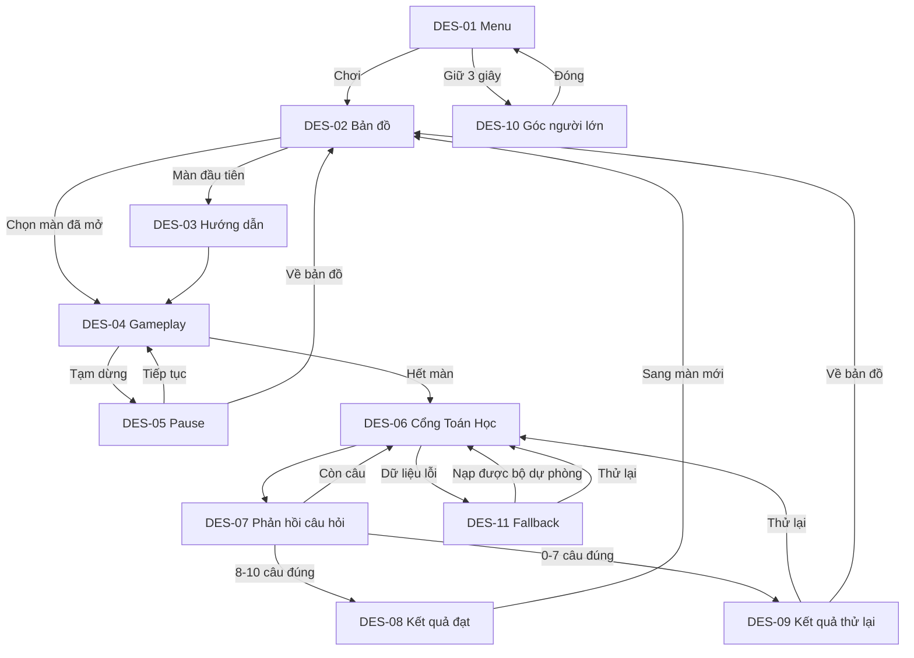

# Screen Flow

## Navigation rules

- Android Back from gameplay opens Pause; it does not immediately leave the level.
- Android Back from quiz opens a confirmation because abandoning the gate discards current quiz answers.
- Android Back from Menu follows the normal Android exit behavior.
- Locked map nodes do not navigate; they provide lock feedback in place.
- After passing, progress is saved before DES-08 is shown.
- DES-11 never exposes stack traces or file paths to the child.
